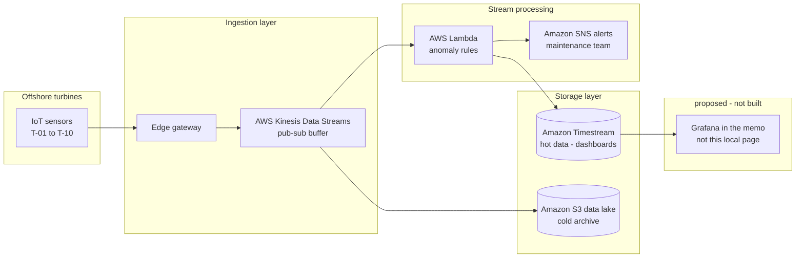

# aerogrid

## what it is

IEUK 2026 Bright Network Technology and Engineering brief (4 days in June): pandas over a 24-hour telemetry csv, flag turbines that break two anomaly rules, plus a short CTO memo with a proposed AWS path. That memo and `architecture_diagram.png` are design only - this repo does not run Kinesis, Lambda, Timestream, S3 or SNS.

After the 4 days, through July: `stream_monitor.py` replays the same csv into sqlite, last-20 mean temp + last-20 max vibration, alert only when a turbine first fails. `dashboard.py` is a local page over that db. Not live sensors.

On the sample (`telemetry_data.csv`, 5000 rows / 10 turbines): **T-04** (whole-file avg temp ~= 90.58 °C) and **T-07** (max vibration = 25.0 mm/s). Batch and the default stream window both flag those two.

Jun 2026 - Jul 2026.

## layout

```
aerogrid/
  README.md
  analyze_telemetry.py   # batch (brief)
  stream_monitor.py      # stream + sqlite alerts (mine)
  dashboard.py           # local html over aerogrid.db (mine)
  thresholds.py          # 85 C / 15 mm/s - batch and stream
  engineering_report.md  # ~300 word cto memo from the brief
  architecture_diagram.png  # proposed AWS path from the brief - not built
  telemetry_data.csv
  run.sh                 # pytest, stream --speed 0, dashboard :8765
  tests/
  requirements.txt
  pytest.ini
  Dockerfile
  docker-compose.yml
  .dockerignore
```

## quick start

```bash
cd aerogrid
./run.sh
```

Then http://127.0.0.1:8765/ - T-04 and T-07 in the table. Ctrl-C stops the page.

Or by hand:

```bash
python3 -m venv .venv
source .venv/bin/activate
pip install -r requirements.txt

# brief - batch (whole-file mean / max)
python analyze_telemetry.py

# mine - stream (speed=0 for ci; try --speed 0.01 to watch)
python stream_monitor.py --csv telemetry_data.csv --db aerogrid.db --speed 0

# local page (fills db if empty)
python dashboard.py
```

Docker:

```bash
docker build -t aerogrid .
docker run --rm aerogrid                          # batch
docker run --rm aerogrid python stream_monitor.py --speed 0

docker compose up dashboard                       # http://127.0.0.1:8765/
docker compose up stream-monitor                  # sqlite on a named volume
docker compose --profile batch up batch-analysis
```

## stack

Python · pandas (batch) · stdlib csv + sqlite3 (stream) · pytest · Docker · Chart.js CDN (local dashboard)

## how its wired

**Brief - batch** (`analyze_telemetry.py`): load the csv, `groupby` turbine, flag if *whole-file* mean temperature > 85 °C or *whole-file* max vibration > 15 mm/s, print the failing IDs.

**My extension - stream** (`stream_monitor.py`): `DictReader` one row at a time. Each turbine keeps a deque of the last 20 readings (`--window`). Temp rule is the mean of that deque. Vibration rule is the max in that deque. First time a turbine crosses into failing: print `ALERT`, insert one `alerts` row, latch. If the window goes healthy, the latch clears and a later spike can fire again. Readings go into sqlite as they arrive. `--speed 0` for tests.

**My extension - dashboard** (`dashboard.py`): small page from that db (alerts table + T-04 / T-07 charts). Empty db: it runs the stream first. Localhost, no auth.

**Brief - AWS proposal only** (not implemented here):



Diagram: `architecture_diagram.png`
CTO memo: [`engineering_report.md`](engineering_report.md)

Sqlite is the local stand-in for that path. Nothing here calls AWS.

## whats interesting

- same thresholds (`thresholds.py`), two shapes. batch is pandas over the whole file. stream is last-N per turbine (deque + running sum, O(1) mean)
- latch: first fail prints once and writes one `alerts` row. staying bad does not spam. a cool window can unlatch - cumulative mean could not do that for temperature
- on this sample T-04 is always >= 86 C and T-07 vibration is always > 15, so default `--window 20` still flags the same two as batch. the recover tests use a tiny synthetic window
- window is last N *rows*, not last N minutes - csv timestamps are strings
- pytest: batch T-04/T-07, healthy turbine, missing columns, latch, window recover, sqlite persist, full stream replay

## limitations

- csv is a fixed 24-hour sample, not live turbines
- stream mean / peak are last N readings, not a time window
- memo and diagram are a proposal. nothing here talks to kinesis / lambda / timestream
- sqlite commits per row. fine at 5k rows
- dashboard is stdlib `http.server`, no auth - bind `127.0.0.1` locally; compose uses `0.0.0.0` inside the container
- closed July 2026. the 4-day brief, then the stream until July. not AWS

## tests

```bash
pytest -q
```

## demo

```bash
./run.sh
```

Then http://127.0.0.1:8765/ (pytest, replay into `aerogrid.db`, serve the page).

Or `python dashboard.py` if the venv is already on. Or `docker compose up dashboard` and the same URL.
